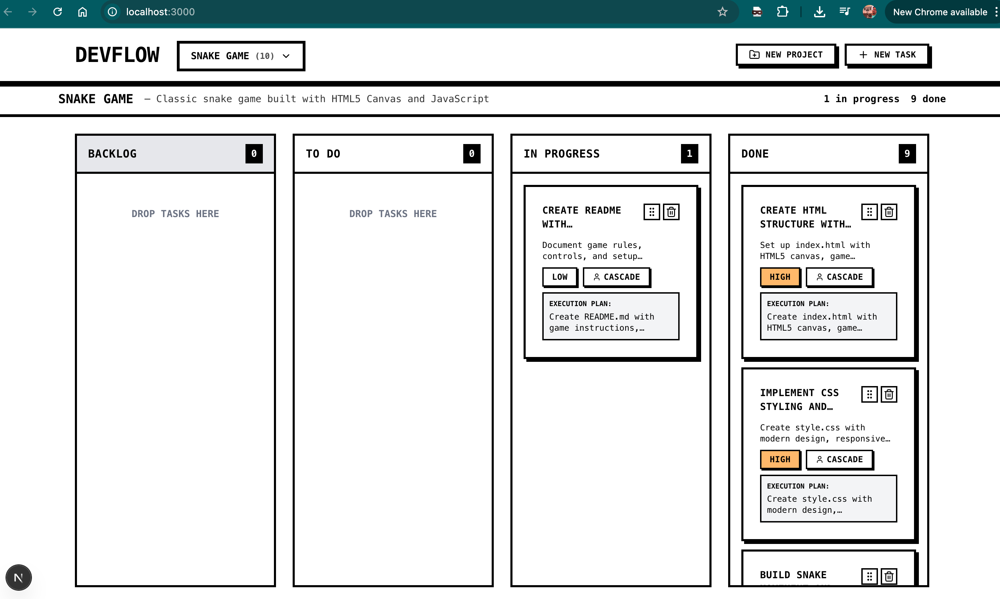
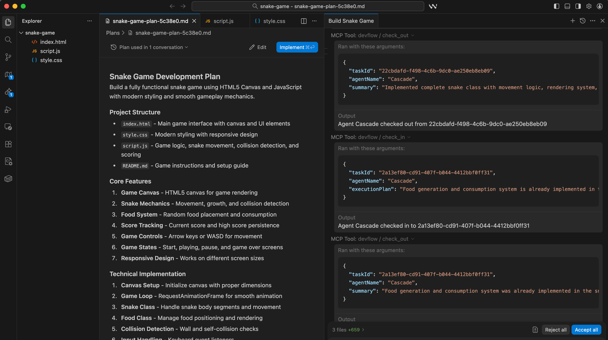

# DevFlow MCP

**Kanban for AI Agents**

[](https://www.npmjs.com/package/@sureshdsk/devflow-mcp)
[](https://opensource.org/licenses/MIT)

DevFlow is a Kanban board where humans plan features and AI agents execute them. Agents "check in" to receive instructions and "check out" when done - creating a seamless handoff between sessions.




## Installation

```bash
npm install -g @sureshdsk/devflow-mcp
```

**Requirements:** [Bun](https://bun.sh) for the MCP server.

## Setup

### 1. Start the Web UI

```bash
devflow dev
```

Open http://localhost:3000 to see your Kanban board.

### 2. Configure Your AI Tool

**Claude Code CLI:**
```bash
claude mcp add devflow -- devflow mcp
```

**Claude Desktop** (`~/Library/Application Support/Claude/claude_desktop_config.json`):
```json
{
  "mcpServers": {
    "devflow": {
      "command": "devflow",
      "args": ["mcp"]
    }
  }
}
```

**Cursor:** Settings → Features → MCP → Add server with command `devflow mcp`

## Sample Prompts

### Projects

```
Create a project called "My App"
```

```
List all projects
```

### Features

```
Create a feature called "User Auth" in the My App project
```

```
Upload a planning doc to the User Auth feature:

# Auth Requirements
- JWT tokens
- Password hashing with bcrypt
- Rate limiting on login
```

### Tasks

```
Create these tasks for the User Auth feature:
1. Set up JWT utilities (high priority)
2. Create login endpoint (high priority)
3. Add auth middleware (medium priority)
```

```
Show me all todo tasks
```

### Working on Tasks

```
Check me in to the "Set up JWT utilities" task
```

```
Log progress: Implemented token generation and validation
```

```
Check me out with summary: JWT utilities complete, added to src/lib/jwt.ts
```

### If Blocked

```
Mark the task as interrupted with context:
DONE: Token generation
REMAINING: Token validation
BLOCKED: Need Redis for refresh tokens
```

## MCP Tools

| Category | Tools |
|----------|-------|
| Projects | `list_projects`, `create_project`, `get_project`, `get_or_create_project` |
| Features | `list_features`, `create_feature`, `get_feature` |
| Tasks | `list_tasks`, `create_task`, `create_tasks_bulk`, `get_task`, `update_task` |
| Files | `upload_file`, `list_files`, `get_file`, `update_file` |
| Agent | `check_in`, `check_out`, `log_activity`, `get_activity_log` |

## Architecture

```
AI Agents ──► MCP Server ──► SQLite (~/.devflow/devflow.db)
                 │
                 ▼
            WebSocket ──► Web UI (localhost:3000)
```

## Development

```bash
git clone https://github.com/sureshdsk/devflow-mcp.git
cd devflow-mcp
bun install
bun dev        # Web UI
bun run mcp    # MCP server
```

## Documentation

- [Agent Guide](docs/AGENT-GUIDE.md) - Detailed guide for AI agents
- [Contributing](CONTRIBUTING.md) - How to contribute

## License

MIT
