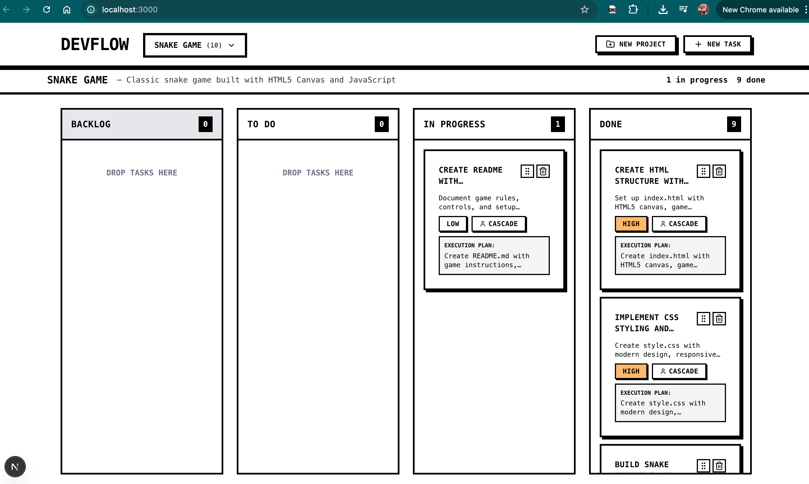
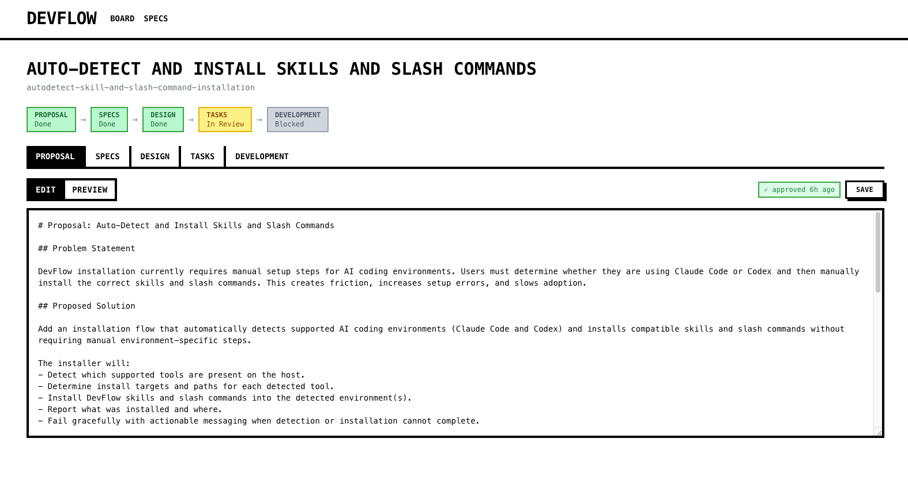

# DevFlow MCP

**Spec-Driven Kanban for AI Agents**

[](https://www.npmjs.com/package/@sureshdsk/devflow-mcp)
[](https://opensource.org/licenses/MIT)

DevFlow lets humans and AI agents collaborate through a spec-first workflow:

`proposal -> specs/design -> tasks -> promote to Kanban`

Agents use MCP tools to write artifacts, check in/out of tasks, and keep execution visible across sessions.




## Requirements

- Node.js 20+

## Install

```bash
npm install -g @sureshdsk/devflow-mcp
```

## Quick Start

### 1. Initialize DevFlow

```bash
devflow init
```

This sets up `~/.devflow/devflow.db` and installs DevFlow skills/commands for detected tools.

### 2. Start the web UI

```bash
devflow dev
```

Open http://localhost:3000.

### 3. Configure your AI tool

**Claude Code CLI**

```bash
claude mcp add devflow -- devflow mcp
```

**Claude Desktop** (`~/Library/Application Support/Claude/claude_desktop_config.json`)

```json
{
  "mcpServers": {
    "devflow": {
      "command": "devflow",
      "args": ["mcp"]
    }
  }
}
```

**Codex (`.codex/config.toml`)**

```toml
[mcp_servers.devflow]
command = "devflow"
args = ["mcp"]
```

**Cursor**

- Settings -> Features -> MCP
- Add server command: `devflow mcp`

### 4. Install/update skills and slash commands

```bash
devflow tool install
```

Useful variants:

```bash
devflow tool install --only codex
devflow tool install --only claudecode
devflow tool install --tools codex
devflow tool install --no-autodetect
devflow tool install --dry-run
devflow tool update
```

## Workflow

### Spec lifecycle

```text
proposal -> specs + design -> tasks -> promote_spec -> Kanban tasks
```

Rules:

- Downstream artifacts stay blocked until prerequisites are approved.
- Editing approved artifacts revokes approval.
- `promote_spec` only works after `tasks` is approved.

### Task lifecycle

```text
backlog -> todo -> in_progress -> done
```

Typical agent flow:

1. `check_in`
2. implement + `log_activity`
3. `check_out`

## Sample Prompts (Codex Slash Commands)

Use these in Codex chat after DevFlow MCP is configured:

### 1. Start a new feature spec

Use case: You want to improve how spec validation feedback is reported in DevFlow.

```text
/df:new
Project: devflow-mcp-v2
Spec name: improve-spec-validation-reporting
Title: Improve Spec Validation Reporting
```

### 2. Continue to the next unblocked artifact

Use case: Proposal is approved and you want Codex to move to `specs` or `design`.

```text
/df:continue
Spec: improve-spec-validation-reporting
```

### 3. Check where the spec stands

Use case: You want to see what is done, what is blocked, and what needs approval.

```text
/df:status
Spec: improve-spec-validation-reporting
```

### 4. Validate quality before promotion

Use case: You want a quality pass on completeness and structure before task promotion.

```text
/df:validate
Spec: improve-spec-validation-reporting
```

### 5. Promote approved tasks to Kanban

Use case: `tasks.md` is approved and you want to create actionable board tasks.

```text
/df:promote
Spec: improve-spec-validation-reporting
```

### 6. Execute promoted tasks one by one

Use case: You want Codex to implement tasks in order with check-in/check-out tracking.

```text
/df:apply
Spec: improve-spec-validation-reporting
```

### 7. Archive completed spec

Use case: All work is complete and you want to move the spec out of active flow.

```text
/df:archive
Spec: improve-spec-validation-reporting
```

### 8. Create a custom schema

Use case: You need a workflow different from the bundled schemas (e.g. ML pipeline, infrastructure, security review).

```text
/df:schema
```

## Custom Schemas

DevFlow ships with bundled schemas (`spec-driven`, `backend-api`, `frontend-product`, `data-engineering`, `devops-platform`), but you can create your own to match your team's workflow.

### How schemas work

A schema defines the **artifact DAG** — which documents exist, what order they follow, and what templates agents use to generate them. The bundled `spec-driven` schema looks like this:

```yaml
name: spec-driven
version: 1
artifacts:
  - id: proposal
    generates: proposal.md
    description: Change intent and scope
    template: proposal.md
    requires: []
  - id: specs
    generates: specs.md
    description: Requirements and scenarios
    template: specs.md
    requires: [proposal]
  - id: design
    generates: design.md
    description: Technical approach
    template: design.md
    requires: [proposal]
  - id: tasks
    generates: tasks.md
    description: Implementation tasks
    template: tasks.md
    requires: [specs, design]
qualityRules:
  requireRfc2119: true
  minScenariosPerRequirement: 1
apply:
  requires: [tasks]
```

The `requires` field creates the approval DAG — an artifact stays blocked until all its prerequisites are approved.

### Creating a custom schema

**Interactive (recommended):** Use the `/df:schema` command to interactively create a schema. It will ask about your project type, workflow stages, and quality preferences, then generate everything for you.

**Programmatic:** Use the `create_schema` MCP tool to create a schema from code.

**Manual:** Place your schema in `devflow/schemas/<schema-name>/`:

```
devflow/
├── schemas/
│   └── my-workflow/
│       ├── schema.yaml
│       └── templates/
│           ├── rfc.md
│           ├── adr.md
│           └── tasks.md
└── specs/
```

**1. Define `schema.yaml`:**

```yaml
name: my-workflow
version: 1
artifacts:
  - id: rfc
    generates: rfc.md
    description: Request for comments
    template: rfc.md
    requires: []
  - id: adr
    generates: adr.md
    description: Architecture decision record
    template: adr.md
    requires: [rfc]
  - id: tasks
    generates: tasks.md
    description: Implementation tasks
    template: tasks.md
    requires: [adr]
apply:
  requires: [tasks]
```

**2. Add templates** for each artifact in `templates/`. These are markdown files that agents use as starting points:

```markdown
# RFC: [Title]

## Context

<!-- What is the background? -->

## Decision

<!-- What are we proposing? -->

## Consequences

<!-- What are the trade-offs? -->
```

**3. Use it when creating a spec:**

```bash
# Via MCP tool
create_spec(name: "my-feature", title: "My Feature", projectId: "...", schema: "my-workflow")

# Or set as project default during init
devflow init --schema my-workflow
```

### Key rules

- The schema `name` in `schema.yaml` must be unique — it cannot conflict with bundled schema names.
- The last artifact should be `tasks` with `## Task: <title>` headings (required for `promote_spec`).
- Project-local templates in `devflow/schemas/` take priority over bundled templates with the same name.

## MCP Tools

| Category | Tools                                                                                                                                                                                                        |
| -------- | ------------------------------------------------------------------------------------------------------------------------------------------------------------------------------------------------------------ |
| Projects | `list_projects`, `create_project`, `get_project`, `update_project`, `get_or_create_project`                                                                                                                  |
| Specs    | `create_spec`, `list_specs`, `get_spec`, `get_spec_status`, `write_artifact`, `get_artifact`, `get_artifact_template`, `approve_artifact`, `draft_artifact`, `validate_spec`, `promote_spec`, `archive_spec` |
| Schemas  | `list_schemas`, `create_schema`                                                                                                                                                                              |
| Tasks    | `list_tasks`, `get_task`, `create_task`, `create_tasks_bulk`, `update_task`                                                                                                                                  |
| Agent    | `check_in`, `check_out`, `log_activity`, `get_activity_log`                                                                                                                                                  |

## Architecture

```text
┌───────────────────────────────────────────────────────────────────────┐
│                           AI Agents                                   │
│                    (Codex / Claude / Cursor)                          │
└───────────────────────────────┬───────────────────────────────────────┘
                                │ MCP protocol (stdio)
                                ▼
┌───────────────────────────────────────────────────────────────────────┐
│                  MCP Server (tsx, src/mcp/server.ts)                  │
│  project/spec/task/agent tools                                       │
│  DB + spec mutations -> broadcastUpdate()                            │
└───────────────┬──────────────────────────────┬────────────────────────┘
                │                              │
                ▼                              ▼
┌───────────────────────────────┐    ┌──────────────────────────────────┐
│ devflow/ (git-tracked)         │    │ SQLite/libSQL DB                │
│ ├─ project-config.json        │    │ ~/.devflow/devflow.db           │
│ └─ specs/<spec-name>/         │    │ - projects                       │
│    - proposal.md              │    │ - tasks (promoted + MCP updates) │
│    - specs.md                 │    │ - agent_activity                 │
│    - design.md                │    └──────────────────────────────────┘
│    - tasks.md                 │
│    - .approvals.json          │
│    - .meta.json               │
└───────────────────────────────┘
                │
                │ broadcastUpdate() for:
                │ - task_created / task_updated / tasks_created
                │ - project/spec/artifact/activity mutations
                ▼
┌───────────────────────────────────────────────────────────────────────┐
│                 WebSocket Server (src/websocket/server.ts)            │
│                              port 3001                               │
└───────────────────────────────┬───────────────────────────────────────┘
                                │ real-time updates
                                ▼
┌───────────────────────────────────────────────────────────────────────┐
│              Web UI (Hono + Vite SPA, localhost:3000)                 │
│  /            -> Kanban board                                        │
│  /specs/:name -> Artifact editor + approve/promote                   │
└───────────────────────────────────────────────────────────────────────┘
```

## Development

```bash
git clone https://github.com/sureshdsk/devflow-mcp.git
cd devflow-mcp
pnpm install
pnpm dev           # Starts Hono API server + Vite dev server concurrently
pnpm typecheck
pnpm lint
```

## Local Package Testing

```bash
pnpm build
npm install -g .
devflow --help
```

Restore published version:

```bash
npm install -g @sureshdsk/devflow-mcp
```

## Documentation

- [Custom Schemas](docs/custom-schemas.md) - creating and using custom schemas
- [Local Dev Guide](docs/local-dev-guide.md) - local development setup
- [AGENTS.md](AGENTS.md) - agent-specific repository guidance
- [Contributing](CONTRIBUTING.md) - contribution guide

## Credits

Inspired by:

- [OpenSpec](https://github.com/Fission-AI/OpenSpec/) — spec-driven development workflow
- [Spec Kit](https://github.github.com/spec-kit/) — structured specification tooling

## Contributors

<a href="https://github.com/sureshdsk/devflow-mcp/graphs/contributors">
  
</a>

## License

MIT
