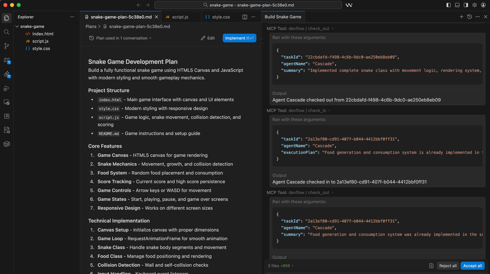

# DevFlow MCP

**Spec-Driven Kanban for AI Agents**

[](https://www.npmjs.com/package/@sureshdsk/devflow-mcp)
[](https://opensource.org/licenses/MIT)

DevFlow lets humans and AI agents collaborate through a spec-first workflow:

`proposal -> specs/design -> tasks -> promote to Kanban`

Agents use MCP tools to write artifacts, check in/out of tasks, and keep execution visible across sessions.




## Requirements

- Node.js 20+ (web UI + CLI)
- Bun 1.0+ (required for `devflow mcp`)

## Install

```bash
npm install -g @sureshdsk/devflow-mcp
```

## Quick Start

### 1. Initialize DevFlow

```bash
devflow init
```

This sets up `~/.devflow/devflow.db` and installs DevFlow skills/commands for detected tools.

### 2. Start the web UI

```bash
devflow dev
```

Open http://localhost:3000.

### 3. Configure your AI tool

**Claude Code CLI**
```bash
claude mcp add devflow -- devflow mcp
```

**Claude Desktop** (`~/Library/Application Support/Claude/claude_desktop_config.json`)
```json
{
  "mcpServers": {
    "devflow": {
      "command": "devflow",
      "args": ["mcp"]
    }
  }
}
```

**Codex (`.codex/config.toml`)**
```toml
[mcp_servers.devflow]
command = "devflow"
args = ["mcp"]
```

**Cursor**
- Settings -> Features -> MCP
- Add server command: `devflow mcp`

### 4. Install/update skills and slash commands

```bash
devflow tool install
```

Useful variants:

```bash
devflow tool install --only codex
devflow tool install --only claudecode
devflow tool install --tools codex
devflow tool install --no-autodetect
devflow tool install --dry-run
devflow tool update
```

## Workflow

### Spec lifecycle

```text
proposal -> specs + design -> tasks -> promote_spec -> Kanban tasks
```

Rules:
- Downstream artifacts stay blocked until prerequisites are approved.
- Editing approved artifacts revokes approval.
- `promote_spec` only works after `tasks` is approved.

### Task lifecycle

```text
backlog -> todo -> in_progress -> done
```

Typical agent flow:
1. `check_in`
2. implement + `log_activity`
3. `check_out`

## Sample Prompts (Codex Slash Commands)

Use these in Codex chat after DevFlow MCP is configured:

### 1. Start a new feature spec

Use case: You want to improve how spec validation feedback is reported in DevFlow.

```text
/df:new
Project: devflow-mcp-v2
Spec name: improve-spec-validation-reporting
Title: Improve Spec Validation Reporting
```

### 2. Continue to the next unblocked artifact

Use case: Proposal is approved and you want Codex to move to `specs` or `design`.

```text
/df:continue
Spec: improve-spec-validation-reporting
```

### 3. Check where the spec stands

Use case: You want to see what is done, what is blocked, and what needs approval.

```text
/df:status
Spec: improve-spec-validation-reporting
```

### 4. Validate quality before promotion

Use case: You want a quality pass on completeness and structure before task promotion.

```text
/df:validate
Spec: improve-spec-validation-reporting
```

### 5. Promote approved tasks to Kanban

Use case: `tasks.md` is approved and you want to create actionable board tasks.

```text
/df:promote
Spec: improve-spec-validation-reporting
```

### 6. Execute promoted tasks one by one

Use case: You want Codex to implement tasks in order with check-in/check-out tracking.

```text
/df:apply
Spec: improve-spec-validation-reporting
```

### 7. Archive completed spec

Use case: All work is complete and you want to move the spec out of active flow.

```text
/df:archive
Spec: improve-spec-validation-reporting
```

## MCP Tools

| Category | Tools |
|----------|-------|
| Projects | `list_projects`, `create_project`, `get_project`, `update_project`, `get_or_create_project` |
| Specs | `create_spec`, `list_specs`, `get_spec`, `get_spec_status`, `write_artifact`, `get_artifact`, `get_artifact_template`, `approve_artifact`, `draft_artifact`, `validate_spec`, `promote_spec`, `archive_spec` |
| Tasks | `list_tasks`, `get_task`, `create_task`, `create_tasks_bulk`, `update_task` |
| Agent | `check_in`, `check_out`, `log_activity`, `get_activity_log` |

## Architecture

```text
┌───────────────────────────────────────────────────────────────────────┐
│                           AI Agents                                   │
│                    (Codex / Claude / Cursor)                          │
└───────────────────────────────┬───────────────────────────────────────┘
                                │ MCP protocol (stdio)
                                ▼
┌───────────────────────────────────────────────────────────────────────┐
│                  MCP Server (Bun, src/mcp/server.ts)                 │
│  project/spec/task/agent tools                                       │
│  DB + spec mutations -> broadcastUpdate()                            │
└───────────────┬──────────────────────────────┬────────────────────────┘
                │                              │
                ▼                              ▼
┌───────────────────────────────┐    ┌──────────────────────────────────┐
│ Spec Files (git-tracked)      │    │ SQLite/libSQL DB                │
│ ./devflow/specs/<spec-name>/  │    │ ~/.devflow/devflow.db           │
│ - proposal.md                 │    │ - projects                       │
│ - specs.md                    │    │ - tasks (promoted + MCP updates) │
│ - design.md                   │    │ - agent_activity                 │
│ - tasks.md                    │    └──────────────────────────────────┘
│ - .approvals.json             │
│ - .meta.json                  │
└───────────────────────────────┘
                │
                │ broadcastUpdate() for:
                │ - task_created / task_updated / tasks_created
                │ - project/spec/artifact/activity mutations
                ▼
┌───────────────────────────────────────────────────────────────────────┐
│                 WebSocket Server (src/mcp/websocket.ts)              │
│                              port 3001                               │
└───────────────────────────────┬───────────────────────────────────────┘
                                │ real-time updates
                                ▼
┌───────────────────────────────────────────────────────────────────────┐
│                 Web UI (Next.js, localhost:3000)                     │
│  /            -> Kanban board                                        │
│  /specs       -> Spec list                                           │
│  /specs/[name] -> Artifact editor + approve/promote                  │
└───────────────────────────────────────────────────────────────────────┘
```

## Development

```bash
git clone https://github.com/sureshdsk/devflow-mcp.git
cd devflow-mcp
bun install
bun dev        # UI dev server
bun run mcp    # MCP server
bun typecheck
bun lint
```

## Local Package Testing

```bash
bun run build
bun install -g .
devflow --help
```

Restore published version:

```bash
bun install -g @sureshdsk/devflow-mcp
```

## Documentation

- [AGENTS.md](AGENTS.md) - agent-specific repository guidance
- [Contributing](CONTRIBUTING.md) - contribution guide

## Credits

Special thanks to [OpenSpec](https://github.com/Fission-AI/OpenSpec/) for this amazing tool that inspired this project.

## License

MIT
